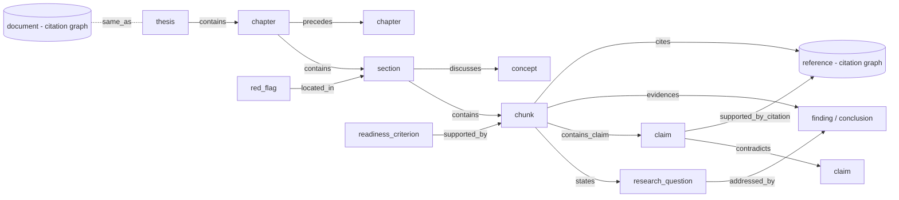

# Thesis Graph Plan

Plan for building a graph of the thesis itself, linking it to the existing academic
references (citation) graph, and using the combined graph for visualisation, retrieval,
assessment and analytics.

## Design Decisions

| Decision | Choice |
|---|---|
| Thesis scope | Data model and APIs keyed by `thesis_id` throughout to allow multiple theses later. Current implementation supports **one thesis, no supplementary material**. |
| Storage | Separate SQLite databases: one thesis graph per thesis, existing shared citation graph, plus a small thesis registry. No merge into `academic_citation_graph.db`. |
| LLM hosting | Local Ollama only (content sensitivity). No cloud LLM calls. LLM cost is ingestion time, so LLM-assisted linking is **on by default** with config switches to disable for faster runs. |
| LLM observability | Every LLM (and embedding) call records token usage, latency, model, operation and cache status so cloud cost can be estimated later. Applies project-wide, not only to the thesis graph. |
| Data compatibility | No backward compatibility or schema migration is required. Generated Chroma and graph data can be rebuilt through fresh ingestion; schema changes may replace generated databases. Preserve source PDFs, profile files and user-authored configuration. |

## Implementation Checklist

- [x] Confirm thesis chunk `thesis_id` and citation document ID use the same canonical ID.
- [x] Add a multi-thesis-keyed SQLite registry with upsert and graph-path mapping.
- [x] Build and register the thesis evidence graph during successful academic ingestion; skip dry runs.
- [x] Enforce cultural lens profile status by environment for academic ingestion (`--cultural-lens`; draft/under-review in Dev only); persist applied profile ID/version/status in the thesis registry.
- [x] Make supported ToC chapter entries authoritative. Explicit `Chapter N`, numbered and wrapped leader-dot/page entries are matched to body headings, including unnumbered titles; validation reports coverage, missing entries, rejected explicit chapter candidates and order, with a non-blocking configurable `ACADEMIC_INGEST_TOC_MIN_COVERAGE` warning.
- [x] Extend ToC parsing for unnumbered/unlabelled outline entries and wrapped chapter titles, including continuation lines before and separate from leader-dot/page rows.
- [ ] Review ToC warning thresholds against representative thesis PDFs.
- [x] Add typed thesis-to-reference bridge edges and claim/reference links.
- [x] Improve reference lookup failures and redirects: preserve the parsed reference title when lookup fails and record the failure separately; follow bounded HTTP redirect chains and record the final target's response rather than the redirect response. Add tests for failed lookups, redirect chains, and redirect loops or missing locations.
- [x] Add a read-only unified loader using the registry and separate SQLite stores; expose Thesis, Thesis + references and References only modes in the Citation Graph tab. Thesis options currently load when the dashboard layout is created; refresh them after UI-driven ingestion in the job-runner task.
- [x] Extend thesis retrieval beyond same-section/chapter siblings via bounded traversal of shared assessment entities; seed expansion from all distinct retrieved chunks for the selected thesis.
- [x] Replace Cartesian research-question-to-finding graph links with per-chunk links meeting the assessor's existing keyword-overlap threshold; store per-question alignment status, score and evidence chunk IDs.
- [x] Append the registry-assigned, version-checked cultural lens guidance to academic RAG prompts for single-thesis retrieval; preserve default/custom system roles and label Dev drafts.
- [x] Surface profile evidence-indicator matches in a separate Assessment panel for human review; do not treat absent matches as failed criteria.
- [x] Use assigned profile inquiry-framing indicators as case-insensitive whole phrases for assessor text selection, candidate extraction and classification; persist source-matched inquiries in the thesis graph.
- [x] Classify explicit candidates as research question, aim, objective, hypothesis or profile-defined inquiry type; retain exact phrase offsets, source chunk and section in analysis/graph; display the type in Assessment.
- [x] Add graph proximity to hybrid vector/BM25 ranking, source-path provenance in answers, and graph-selectable analytics.
- [x] Improve semantic classification of ambiguous/rhetorical candidates and apply approved cultural lens criteria in thesis assessment. Indicator evidence remains a human-review aid rather than a cultural adequacy judgement.
- [x] Extract and locally assess embedded thesis figures. Academic ingestion reuses one Docling conversion for text and figures, invokes the configured local vision model, records token usage, and persists figure metadata, image bytes and assessment output in the per-thesis graph; graph rebuilds preserve those assets, link searchable figure chunks, and record body-text references using explicit printed caption labels.
- [x] Cross-check explicit List of Figures entries, including wrapped titles across lines and chunks, and link adapted figures using unique author-year matches or ordered numeric citations.
- [x] Support additional malformed List of Figures and adapted-figure citation formats, and surface non-text visual review cues without inferring cultural meaning.
- [x] Remove software-code UI, retrieval, graph and Git-ingestion support in tested stages.
- [x] Add dashboard-triggered ingestion and graph jobs with queueing, progress, logs and safeguards.
- [x] Complete project-wide LLM token observability, including per-attempt estimates for failed calls and retries; embedding requests record input estimates only.
- [x] Evaluate the benefits, costs and scope of rewriting project LLM prompts and `AGENTS.md` files to follow ASD-STE100. **Recommendation:** do not rewrite them wholesale. The repository has one root `AGENTS.md` and about 20 embedded prompt templates across six modules. Pilot a small set of strict structured-output prompts first, measuring schema/test reliability and token use; revise the pilot only if it improves clarity without changing domain meaning. Review `AGENTS.md` separately only if concrete ambiguity is found. No prompts or instructions were changed in this evaluation.
- [x] Add the Dev Container baseline and document host-service access via `host.docker.internal`.
- [x] Use regeneration rather than migration for generated stores after schema changes; no legacy-data migration path.

## 1. Current State

| Graph | Store | Contents | Consumers |
|---|---|---|---|
| Citation graph | `rag_data/academic_citation_graph.db` (`nodes`, `edges`, `metadata`) | One `document` node per thesis, one `reference` node per resolved reference, `document -cites-> reference` edges only | Citation Graph tab (`scripts/ui/academic/citation_graph_viz.py`, `citation_graph_callbacks.py`), `PhDQualityAssessor._extract_citations()` |
| Thesis evidence graph | `rag_data/thesis_graphs/<thesis_id>.sqlite` (`scripts/thesis_graph/thesis_evidence_graph.py`) | `thesis -> chapter -> section -> chunk` (`contains`), plus `research_question`, `claim`, `method`, `finding`, `conclusion`, `readiness_criterion` nodes | `retrieve.py` (`enable_thesis_graph`, sibling-chunk expansion), Assessment tab (readiness evidence via `get_readiness_criterion_sources()`) |
| Consistency graph | `rag_data/consistency_graphs/consistency_graph.sqlite` | Document-level similarity/conflict edges and risk/topic clusters | Graph tab, Heatmap, Graph Analytics tab, `GraphEnhancedRetriever` |

### Gaps

1. **No bridge between the thesis and its references.** The citation graph only records
   that the thesis cites a reference; it does not record *where* (chunk/section/claim). The
   `academic_citation_edges.mention_text` / `mention_position` columns exist but are unused.
2. **Thesis graph is not part of ingestion.** It is built from the CLI
   (`build_thesis_evidence_graph.py`) or rebuilt on every Assessment tab render.
3. **Weak semantic edges.** `research_question -addressed_by->` is a Cartesian product over
   all finding/conclusion nodes; claims are linked to a chunk only by exact substring match;
   no concept, contradiction, or sequence edges.
4. **Not visualised.** No graph view for the thesis graph; Graph Analytics only reads the
   consistency graph.
5. **Retrieval uses the graph shallowly.** `expand_evidence_chunk_ids()` returns same-section /
   same-chapter siblings from a single seed chunk; typed relations are ignored.
6. **ID alignment unverified.** Citation graph `document` node uses `compute_doc_id(path)`;
   thesis chunks use `thesis_id` set in `stage_chunk_and_store()`. These must be guaranteed
   identical for the bridge to work.

## 2. Target Model

Keep the thesis graph per-thesis and the citation graph shared; join them through bridge
edges whose targets are citation-graph `node_id`s. A unified loader composes the layers on
demand.

Each node/edge carries a `layer` attribute when loaded: `thesis`, `citation`, or `bridge`.

### Multi-Thesis Keying

Built now (single thesis exercised), so later expansion needs no schema migration:

- **Registry** `rag_data/thesis_graphs/registry.sqlite`, table `thesis_registry`:
  `thesis_id` (PK), `title`, `authors`, `source_path`, `file_hash`,
  `citation_doc_node_id`, `graph_path`, `schema_version`, `built_at`, `status`,
  `document_role` (`main` only for now; reserved for future `supplement`).
- **Per-thesis graph DB** `rag_data/thesis_graphs/<thesis_id>.sqlite` (existing
  `get_thesis_graph_path()`). Every node and edge row carries `thesis_id`; node IDs are already
  hashed with `thesis_id` by `_node_id()`.
- **Bridge edges** target global citation-graph `node_id`s, so references shared by future
  theses become shared nodes without duplication.
- **APIs take `thesis_id` explicitly** (no implicit "the thesis"). Loader signatures accept
  `thesis_ids: list[str]`; current implementation validates `len(thesis_ids) == 1` and raises
  a clear error otherwise.
- **UI**: thesis selector populated from the registry; auto-selected and hidden when only one
  thesis is registered.
- **Remove single-thesis assumptions** such as the fuzzy fallback strategies in
  `PhDQualityAssessor._extract_citations()` ("only one document in graph"); resolve via the
  registry instead.
- **Out of scope now**: cross-thesis edges, supplementary material ingestion, multi-thesis
  comparison views.

## 3. Phased Plan

### Phase 0 - Foundations

- Verify and enforce `thesis_id == citation graph document node_id`; add a test that ingests a
  fixture thesis and asserts the match. Record the mapping in `thesis_registry.citation_doc_node_id`
  if they cannot be unified.
- Create the thesis registry and register the thesis during `ingest_academic.py`.
- LLM usage instrumentation (see Cross-Cutting: LLM Usage Observability) lands here so all
  later phases are measured from the start.
- Add schema versioning (`metadata.schema_version`) to the thesis graph; rebuilds are
  deterministic so migration is "rebuild".
- Extend `edges` with `weight REAL`, `confidence REAL`, `attributes_json TEXT` (mention text,
  offsets, method `heuristic|llm`).
- Config in `scripts/ingest/academic/` config / `rag_config.py`:
  `THESIS_GRAPH_BUILD_ON_INGEST`, `THESIS_GRAPH_CITATION_MIN_CONFIDENCE`,
  `THESIS_GRAPH_ENABLE_LLM_LINKING` (default `true`), `RAG_THESIS_GRAPH_MAX_HOPS`.
- LLM-assisted steps use the local models configured via `INGEST_LLM_MODEL` /
  `INGEST_VALIDATOR_LLM_MODEL`, results cached in `cache.db` so rebuilds avoid repeat calls.

### Phase 1 - Build During Ingestion

- In `ingest_academic.main()`, after thesis chunks are stored and the citation graph is
  written, call `build_thesis_evidence_graph()` (guarded by config and `--build-thesis-graph`
  / `--no-thesis-graph` CLI flags; skipped on `--dry-run`).
- Assessment tab: load the persisted graph, rebuild only if missing or older than the
  latest ingest (compare `built_at` with chunk ingest timestamp). Removes per-render rebuilds.
- Audit events: `thesis_graph_built`, `thesis_graph_build_failed`.

### Phase 2 - Thesis Graph Enrichment

New module `scripts/thesis_graph/` components (wired into `build_thesis_evidence_graph()`):

| Component | Output | Source |
|---|---|---|
| `citation_linker.py` | `chunk -cites-> ref:<id>` bridge edges with marker text, offset, confidence | In-text marker detection (author-year, numbered `[12]`, ranges `[3-5]`, footnotes) reusing patterns in `parser.py` and `PhDQualityAssessor._detect_orphaned_claims()`; resolution against `academic_references` (surname + year, `a/b` suffixes; numbered via reference-list order) |
| Claim support | `claim -supported_by_citation-> reference` | Citations within the claim sentence or adjacent sentence; optional LLM confirmation |
| Concepts | `concept` nodes; `section -discusses-> concept`; `concept -introduced_in/developed_in/concluded_in-> chapter` | `academic_terminology.db`, `StructureAnalysis.key_concepts` / `_track_concept_progression()` |
| Sequence | `chapter -precedes-> chapter`, `section -next-> section` with `flow_score` weight | `sequence_number`, `chapter_flow_scores` |
| RQ alignment | Replace Cartesian `addressed_by` with scored edges | Embedding similarity RQ vs finding/conclusion sections; optional LLM verdict |
| Contradictions | `claim -contradicts-> claim` | `_detect_contradictions()` / `_detect_contradictions_llm()` |
| Red flags | `red_flag` nodes `-located_in-> section` | `detect_red_flags()` `location` field |

Also write back aggregated mentions to the citation side: populate
`academic_citation_edges.mention_text` / `mention_position` and a per-reference
`mention_count` / `cited_in_chapters` attribute so the citation graph benefits independently.

### Phase 3 - Unified Loader

- `scripts/thesis_graph/unified_graph.py`:
  `load_academic_graph(thesis_ids, mode, granularity, entity_types, reference_filters) -> nx.DiGraph`
  (single `thesis_id` enforced for now)
  - `mode`: `thesis` | `thesis_and_references` | `references`
  - `granularity`: `chapter` | `section` | `chunk` (chunk edges aggregated upwards with
    summed weights when coarser)
  - `reference_filters`: existing persona / link status / venue filters passed through to
    `CitationGraphViz.load_graph()`
- `references` mode = current citation graph behaviour, so existing callers are unaffected.
- LRU+TTL caching via `scripts/utils/cache.py` keyed on graph file mtimes.

### Phase 4 - Dashboard Graph View

Extend the Citation Graph tab (rename label to "Academic Graph"):

- **View mode** radio: Thesis only / Thesis + References / References only (default keeps
  today's behaviour).
- **Thesis selector** (reuse `populate_assessment_doc_options()` source).
- **Granularity** dropdown (chapter / section / chunk; default section).
- **Entity types** checklist (RQ, claim, method, finding, conclusion, concept, readiness,
  red flag).
- Existing reference filters apply only to the reference layer and are disabled in
  "Thesis only" mode.
- Encoding: thesis layer uses distinct shapes per node type and a hierarchical
  left-to-right layout ordered by `sequence_number`; references positioned beside the
  sections that cite them; bridge edges thin and coloured by confidence; red-flag nodes
  coloured by severity.
- Node details panel: chunk text preview, linked references (with quality/link status), linked
  claims, readiness criteria.
- Cross-tab navigation: clicking a readiness criterion or red flag in the Assessment tab
  opens the graph focused on that node's neighbourhood.
- Export: extend `export_citations_csv()` to export the unified graph (nodes/edges CSV, JSON).
- Changes in `citation_graph_viz.py` (layout, encoding), `citation_graph_callbacks.py`
  (`update_citation_graph()` inputs, `display_node_details()`).

### Phase 5 - Query / Retrieval

- `expand_evidence_chunk_ids()` -> typed traversal `expand_thesis_graph()`:
  - Use top-n thesis seeds, not only the first chunk with `chroma_chunk_id`.
  - Relation-weighted hops: same section > claim -> supporting reference chunks >
    concept -> other sections > RQ -> findings/conclusions.
  - Cross into reference chunks in ChromaDB (`source_category="academic_reference"`, matched
    by ref ID) when mode allows; bounded by `RAG_THESIS_GRAPH_MAX_HOPS` and
    `RAG_THESIS_GRAPH_MAX_CHUNKS`.
- **Hybrid scoring:** add a graph-proximity score as a third signal alongside vector and BM25
  in `scripts/search/hybrid_search.py`; weights managed by `hybrid_search_weights.py` and
  learned by `adaptive_weighting.py`.
- **Graph-first intents** (`query_expansion.py` / query templates): "Where is RQ2
  addressed?", "Which sources support claim X?", "Which chapters rely on Smith (2020)?",
  "How does concept Y develop?". Answer from graph paths, then fetch chunks.
- **Persona behaviour** (`persona_retrieval.py`):
  - Supervisor: structural neighbours, chapter flow, RQ -> finding paths.
  - Assessor: claim -> citation verifiability; penalise chunks whose supporting
    references are stale/low quality.
  - Researcher: reference and concept neighbourhoods, wider hop limit.
- **Context assembly** (`assemble.py`): include provenance path, e.g.
  `Ch 3 > 3.2 Method > claim "..." -> cites Smith 2020 (Q1, available)`.
- Conversation export and `retrieval_method` metadata record which graph edges were used.

### Phase 6 - Assessment

Replace or strengthen heuristics in `PhDQualityAssessor` using the graph:

| Analysis | Graph-based approach |
|---|---|
| Orphaned claims | Claims with no `supported_by_citation` edge |
| Citation density per section | Count of bridge edges per section rather than regex density |
| Reference reliance risk | Share of claims supported by stale / low-quality / unresolved references, per chapter |
| Literature integration | References cited only in the literature review and never in discussion/conclusion |
| Load-bearing references | References supporting many claims across chapters (concentration risk) |
| RQ alignment | Path completeness RQ -> finding -> conclusion |
| Concept orphaning | Concepts with `introduced_in` but no `developed_in` / `concluded_in` |
| Internal consistency | `contradicts` edges surfaced with locations |
| Citation misrepresentation | Targeted LLM check on each `claim -> reference` pair against reference chunks (replaces broad sampling in `analyse_citation_misrepresentation()`) |
| Argument flow | Feed `analyse_argument_flow_graph()` from thesis graph sequence/claim edges |

`_extract_citations()` should read thesis-specific references via the bridge edges, removing
its fuzzy fallback strategies.

### Phase 7 - Graph Analytics

- Add a **graph source** selector to the Graph Analytics tab: consistency / citation /
  thesis / thesis + references. `compute_analytics()` currently builds from `graph_store` only.
- Persist computed analytics in thesis graph `metadata` (mirrors `graph_store.get_analytics()`).
- Thesis-specific metrics: reference betweenness across chapters, concept centrality,
  chapter connectivity, bridge coverage (% of sections with citations), RQ path completeness,
  reference concentration (claims supported by top-5 references), communities over
  thesis + references (literature clusters vs chapters).

### Phase 8 - Other Extension Points

- **Consistency graph:** optional claim-vs-cited-reference consistency check reusing the LLM
  consistency engine (`consistent` / `partial_conflict` / `conflict`).
- **Heatmap tab:** chapter x reference-cluster citation matrix.
- **Domain terms:** boost concept nodes' terms in `domain_terms.py` for thesis-scoped queries.
- **Word cloud:** per chapter / per concept community.
- **Benchmarks:** compare retrieval with and without thesis-graph expansion
  (`benchmark_manager.py`).
- **Notebook:** thesis graph verification notebook (node/edge counts, bridge resolution rate,
  unresolved markers).
- **Staleness revalidation:** when `--revalidate` changes a reference's `link_status`,
  recompute reliance-risk metrics without rebuilding the thesis graph.

## Cross-Cutting: LLM Usage Observability

Current state: `TokenCounter.record_tokens()` (`scripts/utils/monitoring.py`) and
`instrument_ollama_call()` (`scripts/utils/llm_instrumentation.py`) exist, but only
`generate.py` records tokens, using a `len(text) // 4` estimate. Direct `llm.invoke()` calls in
`preprocess.py`, `vectors.py`, `build_consistency_graph.py` and
`PhDQualityAssessor._llm_invoke()` record nothing.

Plan:

1. **Single invocation helper** in `llm_instrumentation.py`, e.g.
   `invoke_llm(llm, prompt, operation, context) -> str`, which:
   - reads Ollama usage fields (`prompt_eval_count`, `eval_count`, `total_duration`,
     `load_duration`, `done_reason`). Confirm in Phase 0 whether the installed
     `langchain_ollama` exposes these via generation info; if not, call `/api/generate` /
     `/api/chat` directly over HTTP (pattern proven in another project) so counts are
     reliable;
   - records to `TokenCounter` (OpenTelemetry), `metrics_collector.record_llm_call()`, and a
     structured `audit("llm_usage", {...})` event.
2. **Reported vs estimated accounting.** Ollama returns no counts when a call errors, so every
   exit path must record something:

   | Outcome | Accounting |
   |---|---|
   | Success with counts | `token_source="reported"` |
   | Success without counts | Estimate prompt and completion from text, `token_source="estimated"` |
   | Read timeout / connection error / HTTP >= 400 / invalid JSON | Estimate prompt tokens (completion 0), `success=false`, `failure_reason`, recorded **before** raising |
   | Empty response or `done_reason="length"` with no content | Reported counts if present, else estimate; `success=false` |
   | Abandoned attempt that returned counts (e.g. context-exhausted retry with larger `num_ctx`) | Count carried forward so retried work is not lost |
   | Retry via timeout backoff | Each attempt recorded with `retry_attempt` |
   | Model-not-found fallback | Recorded against the model actually used, with `requested_model` |
   | Truncated response (`done_reason="length"`) | `truncated=true` flag |

   Estimation uses a shared `estimate_tokens_from_text()` helper (tokeniser if available,
   otherwise character heuristic) in place of the ad-hoc `len(text) // 4` in `generate.py`.
3. **Event fields**: `run_id`, `operation` (e.g. `thesis_graph.claim_support`,
   `assessment.citation_misrep`, `rag.generate`, `consistency.pair_check`), `component`,
   `model`, `requested_model`, `thesis_id` (when applicable), `input_tokens`,
   `output_tokens`, `token_source`, `latency_ms`, `num_ctx`, `cache_hit`, `retry_attempt`,
   `truncated`, `success`, `failure_reason`.
4. **Cache hits**: store original token counts with cached LLM results in `cache.db`; on a hit
   log `cache_hit=true` with the original counts so estimates can be produced both with and
   without caching.
5. **Retries**: attempts made by `retry_utils` decorators and by the helper itself are each
   logged as their own event, including failed attempts with estimated prompt tokens.
6. **Embeddings**: record embedding input tokens (`/api/embed` returns `prompt_eval_count`)
   under a separate `operation` prefix (`embedding.*`), as cloud embedding APIs are also
   billed per token.
7. **Retrofit all call sites** to use the helper: `preprocess.py`, `vectors.py`,
   `build_consistency_graph.py` (pair checks, critique, cluster labelling),
   `phd_assessor.py`, `generate.py` (replace the `// 4` estimate), and all new thesis graph
   LLM steps.
8. **Reporting**: `scripts/utils/llm_usage_report.py` CLI aggregating `llm_usage` events by
   `run_id` / `operation` / `model` / `thesis_id`, separating reported and estimated totals,
   plus a Metrics tab panel. Optional `LLM_PRICING_JSON` (per-million input/output token
   rates, supplied by the user, no hard-coded prices) to produce an estimated cloud cost.
9. **Content safety**: events contain counts and identifiers only, never prompt or response
   text, consistent with the local-only content sensitivity requirement.

## 4. Future Tasks

These extend the thesis graph work. Dependencies on the phases above are noted for each.

### F1 - Validate Extracted Chapters Against the Table of Contents

**Current state.** `CHAPTER_AWARE_INGESTION_MIGRATION.md` marks chapter-aware ingestion as
complete, but chapter boundaries are still derived from a heading rubric in
`pdfparser.extract_structure_from_text()` (Docling Markdown headings, `Chapter N` /
Roman / numbered regexes, a fixed list of standard section names). ToC lines are actively
*discarded* via `_is_table_of_contents_entry()`. The ToC is only parsed later, in
`PhDQualityAssessor._parse_toc_structure()`, and only to order chapters, not to validate or
correct them. Extracted chapters therefore do not reliably reflect the thesis's own ToC.

**Tasks.**
- Parse the ToC (and List of Figures / List of Tables, used by F2) at ingestion into an
  outline: title, level, numbering, page number, order. Prefer Docling structure where
  available, regex fallback otherwise.
- Align detected headings to ToC entries using numbering, normalised title similarity, order
  and page numbers.
- Treat the ToC as authoritative when present: rename/merge/split detected chapters to match;
  rubric detection becomes the fallback when no ToC is found.
- Validation report per ingest: ToC coverage %, missing chapters, spurious chapters
  (rubric false positives, e.g. numbered cultural lists), order mismatches, page-span
  anomalies. Warn or fail against a configured threshold, extending the existing
  `validate_thesis_chunk_structure()`.
- Persist outline in the thesis registry / graph (`toc_entry` nodes, `toc_verified`
  attribute on chapter and section nodes).
- Remove the ToC re-parsing in `phd_assessor.py` once ingestion supplies the outline.
- Correct the status in `CHAPTER_AWARE_INGESTION_MIGRATION.md` (done: item marked partial).

**Dependency.** Should precede Phase 1 so the thesis graph's chapter and section nodes are
trustworthy.

### F2 - Multimodal Assessment of Figures

**Current state.** Academic ingestion extracts Docling picture/chart metadata, image objects,
captions, descriptions, page numbers and bounding boxes in the same conversion as the text.
Docling picture-image generation is enabled by default (`DOCLING_GENERATE_PICTURE_IMAGES=true`);
figures without locally available image bytes retain metadata and receive an explicit unavailable
or human-review status without aborting ingestion. It assesses available figures with the local
Ollama vision model (default `qwen3.6:27b`), skips figures
whose caption/alt text matches profile sensitivity terms, and stores image blobs plus
human-review assessment output in the per-thesis graph database. Figure assets survive later
graph rebuilds. Figure descriptions/captions/alt text are also stored as searchable typed
chunks. When a caption maps to a known heading span, the graph links the figure to that
section; otherwise it remains contained by the thesis root. Sensitivity terms can be matched
against captions, alt text and legible text inside images; semantic visual sensitivity is not
inferred. Local vision assessment independently
describes each image, then checks caption and alt-text alignment with that description;
these results remain human-review evidence. It also classifies bounded nearby thesis prose,
excluding the caption span, and stores a supporting quote when one is available; this is not a
whole-thesis determination.

**Tasks.**
- [x] Extract figures with Docling, retaining page, bounding box, caption, alt text where
  available, figure number and image bytes in the thesis graph asset table.
- [x] Enable Docling picture-image generation by default; handle figures without image bytes as
  unavailable/review-required without failing document ingestion.
- [x] Expose searchable figure chunks and link figure nodes to a section when the caption maps
  to a known heading span; retain thesis-root containment when no section can be resolved.
- [x] Reconcile explicit caption labels and titles against List of Figures entries, including
  wrapped continuation lines across chunks. Persist matched, not-listed, title-mismatch,
  ambiguous, and unavailable states on figure nodes; distinguish a missing list from entries
  that could not be parsed.
- [x] Assess with local Ollama (`VISION_LLM_MODEL`) for description, figure type, caption
  alignment, alt-text quality, and separate caption/alt-text-to-description alignment, plus
  visible findings and limitations; results always require human review. Missing caption or
  alt text is explicitly recorded as `not_provided`. Token usage and failed-call estimates are
  recorded without logging prompt/image data.
- [x] Detect figure mentions using explicit printed caption labels and link body chunks to
  figure nodes; exclude List of Figures sections and mapped caption source spans. Internal
  extraction-order IDs are not used as printed labels. This records references only.
- [x] Persist whether explicit references were found, the caption number was unavailable, or
  source offsets were unavailable or partial; do not equate no detected mention with an
  unreferenced figure.
- [x] Classify caption-adjacent and explicit figure-reference excerpts as interpretation,
  description, mention-only, no discussion in context, unclear or unavailable; exclude the
  caption itself and retain a verbatim supporting quote for positive results.
- [x] Assess discussion beyond caption-adjacent text using up to three bounded excerpts from
  explicit figure references across the thesis; exclude captions and obvious List of Figures
  rows, and do not infer that the whole thesis lacks discussion from these samples.
- [x] Reconcile Markdown-table List of Figures rows, including a separate page-number column.
- **Model choice:** default `VISION_LLM_MODEL=qwen3.6:27b`. It is already pulled, is the
  project default text model, and `/api/show` reports the `vision` capability, so figure
  assessment needs no model swap within the 32 GB VRAM of the RTX 5090. `gemma4:26b` (also
  vision-capable and already pulled) is the alternative for comparison or second-opinion
  checks. `llama4:scout` (108B) also reports vision but will not fit in VRAM and is not
  recommended. Register vision capability in `llm_model_config.py` and verify the
  configured model reports `vision` at start-up.
- [x] Store captions, alt text and vision descriptions as searchable thesis chunks
  (`chunk_type="figure"`) and link section-resolved figure nodes to their section.
- [x] Add graph edges from searchable figure chunks to their figure nodes, preserving the
  vector-store chunk ID in the graph.
- [x] Link adapted, modified, reproduced or redrawn figures to thesis-cited references when an explicit author-year caption citation has one unique match. Persist stable citation node IDs and `adapted_from` graph edges across rebuilds.
- [x] Resolve ordered singleton `[n]`, range (`[n-m]`) and list (`[n, m]`) adapted-figure citations using the source thesis's citation edges; leave out-of-range numbers unresolved.
- [x] Resolve explicitly labelled `Footnote N:` adapted-figure references and plain author-year captions; leave missing or conflicting footnotes unresolved/ambiguous.
- Assessment additions: unreferenced figures, captions not supported by the image, figures
  carrying findings not discussed in text.
- [x] Profile-declared sensitivity terms in captions/alt text flag figures for human review
  and skip automated description.
- [x] Match image-applicable sensitivity terms against locally transcribed, legible image text;
  report complete, partial or unclear text coverage; flag matches and incomplete screens for
  human review. Persist only sensitivity IDs and token usage, not the transcription or
  generated description.
- [x] Surface fixed-vocabulary non-text visual review cues (person/face, injury/medical,
  document/identifier, unclear non-text detail) without assigning cultural meaning. Cues flag
  human review and suppress generated descriptions/findings; they do not assign profile
  sensitivity IDs. Image tokens are recorded when Ollama reports counts, with text-token
  estimates on failures.

**Dependency.** Uses F1 List of Figures; extends Phase 2 node types and Phase 6 assessment.

### F3 - Culturally Aware Assessment

**Current state.** Assessment criteria, prompts and concept extraction assume a generic
Western academic frame. They do not recognise, for example, the significance of Country or
kinship relationships to healing concepts, relational methodologies, or community
accountability.

**Approach.** A cultural lens is applied only when the thesis warrants it; it must not be
inferred from stereotypes.

- **Lens detection (per thesis):** classify the thesis's cultural context and research
  paradigm from its stated positionality, methodology, ethics approvals and key terminology
  (heuristics plus local LLM). Store on the registry row as `cultural_lens` with confidence
  and evidence spans; user can confirm, override or set to none in the UI.
- **Lens profiles:** JSON profiles under `rag_data/cultural_lenses/`, validated against
  `cultural_lens.schema.json`. Initial draft:
  `aboriginal_torres_strait_islander.json` (status `draft`, every entry marked for review).
  Profiles should be authored or reviewed by people with the relevant cultural authority,
  not generated by the LLM. Profile sections: scope (`applies_to`), governance (authors,
  reviewers, approval, permissions, change log), detection signals, frameworks, concepts and
  relations, terminology (preferred, capitalisation, spelling variants, terms to avoid),
  sensitivities and handling, emphasised topics, assessment criteria, research question
  framings, deficit-framing indicators, answer guidance. Retrieval term weights reuse
  `rag_data/domain_terms/<name>.json` via `domain_terms_ref`.
- **Profile governance (to be developed through consultation):** the review and approval
  process, attribution, and evidence of representation and authority to speak on behalf of
  peoples or communities will be defined with community consultation. The schema's
  `governance` section is a provisional placeholder that will evolve with that outcome.
  Until a governance model is agreed, profiles remain `draft` and are usable in Dev only
  (see draft usage below).
- **Profile format and editing (decision):** files are the source of truth, not a database
  or a form-only store, because they are versioned, diffable and auditable (who reviewed
  what and when), which matters for cultural governance.
  - Phase A: hand-edited JSON, schema-validated at load; CSV import for bulk lists
    (terms, sensitivities) for reviewers who prefer spreadsheets.
  - Phase B: dashboard form generated from the same JSON Schema to create, clone, edit and
    review profiles; it reads and writes the same files.
  - Nuances: child profiles use `extends` to add or override entries by `id` for specific
    nations, communities or regions (e.g. a Torres Strait Islander or nation-specific profile).
  - Restricted content: profiles with `contains_restricted_content=true` live in
    `rag_data/cultural_lenses/private/` (git-ignored).
- **Applying profiles:** `ingest_academic.py --cultural-lens <profile_id>` (or the lens
  suggested by detection and confirmed by the user) records `profile_id` and `version` on the
  thesis registry row. Ingestion uses it for concept nodes, sensitivity flags and term
  weighting; query, assessment and dashboard read it from the registry, with an optional
  per-request `cultural_lens` override (including `none`). Re-applying a newer profile
  version re-runs lens-dependent steps only.
- **Draft usage (Dev only):** profiles with status `draft` or `under_review` can be used for
  development when `ENVIRONMENT=Dev`; they are not suitable outside Dev.
  - The profile loader enforces this: in Test or Prod, selecting a non-`approved` profile
    fails with a clear error (CLI, API, F6 jobs), and the dashboard lists approved profiles
    only. There is no override flag.
  - The registry records `cultural_lens_status` alongside `profile_id` and `version`. Outputs
    produced with a draft lens are labelled "draft cultural lens - development use only" in
    answers, assessment reports and exports.
  - Lens-dependent artefacts built with a draft profile (concept nodes, sensitivity flags,
    lens criteria) are tagged; if data is moved to Test or Prod, these are ignored and the
    thesis must be re-processed with an approved profile version.
  - Tests use fixture profiles with an explicitly patched `ENVIRONMENT=Dev`, plus tests
    asserting rejection in Test and Prod.
- **Assessment:** lens-specific readiness criteria (e.g. relational accountability, community
  involvement and governance, consent and data sovereignty, appropriate methodology such as
  yarning or other culturally grounded methods, strengths-based framing), shown alongside,
  not replacing, generic criteria. The current Dev panel surfaces case-insensitive, whole-phrase
  profile-indicator matches for human review, centres the displayed excerpt on the matched
  phrase, and carries absolute phrase offsets when chunk source positions are available. It
  does not treat a missing match as a failed criterion or cultural adequacy judgement.
- **Graph:** lens concepts become `concept` nodes with lens-defined relations (e.g.
  Country - kinship - healing), so retrieval and assessment can follow culturally meaningful
  links (Phase 2 concepts, Phase 5 traversal).
- **RAG answers:** inject lens guidance into the academic prompt in `assemble.py` so answers
  respect the thesis's framing and terminology.
- **Sensitivity:** flag content that may require restricted handling (e.g. references to
  deceased persons, gender-restricted or sacred knowledge) for human review, extending
  `scripts/security/dlp.py`.
- **Evaluation:** a small reviewed benchmark of expected culturally aware answers per lens.

**Dependency.** Informs F4; uses Phase 2 concept nodes and Phase 6 assessment.

### F4 - Improved Identification of Research Questions

**Current state.** `PhDQualityAssessor._extract_research_questions()` collects likely inquiry
sections, extracts explicit RQ markers, aim/objective/purpose statements and configured cultural
framings, and classifies candidates into inquiry types with an optional local LLM. Invalid or
missing classifier output falls back to deterministic labels; `not_rq` candidates are excluded.
It excludes appendix instruments and retains source spans. It now selects pre-matter and
main-matter chunks using F1 section identity,
with ToC and appendix-instrument exclusions. An opt-in local-LLM step reconciles clearly
equivalent same-type introduction/conclusion restatements, retaining the introduction wording,
aliases and source evidence. Explicit RQ labels receive stable IDs, sub-questions retain parent
IDs, and the hierarchy is persisted in the thesis graph. Reviewers can edit and confirm the
inquiry set in Assessment; confirmed records are persisted on the thesis registry and reused
for alignment and graph builds.

**Tasks.**
- [x] Include inquiry text from abstract, introduction, methodology/methods, research design,
  research-question/aim/objective and conclusion sections; exclude appendix instruments.
- [x] Replace keyword-based section selection with F1 pre/main-matter section identity for
  broader narrative coverage across introduction, methodology and conclusion.
- [x] Classify candidates into `research_question`, `sub_question`, `aim`, `objective`,
  `hypothesis`, `guiding_question`, or `not_rq` (e.g. interview protocol, rhetorical
  question) with the opt-in local LLM; validate labels/indexes and retain source spans.
- [x] Recognise culturally grounded framings (F3), including inquiry framed as aims, yarning
  topics or community-defined purposes rather than interrogatives.
- [x] Match configured cultural framing indicators as case-insensitive whole phrases during
  text selection, candidate extraction and inquiry classification.
- [x] Apply the final substantive-content filter before the candidate output limit so
  low-quality fragments do not crowd out later valid inquiries.
- [x] Deduplicate case/whitespace variants and leading RQ/list labels while preserving the
  original inquiry text and source occurrences.
- [x] Reject misaligned supplied document, metadata and chunk-ID arrays during inquiry source
  mapping rather than silently producing incomplete provenance.
- [x] Reconcile clearly equivalent same-type introduction/conclusion restatements using the
  opt-in local LLM; retain canonical wording, restatement aliases and all source evidence in the
  assessment and thesis graph.
- [x] Assign stable canonical IDs to explicit RQ1..n and sub-question labels, persist parent
  relationships in the thesis graph, and show the IDs in the Assessment view.
- [x] Let reviewers confirm or edit the extracted inquiry set; persist the confirmed set on the
  thesis registry and use it for subsequent RQ alignment and graph assessment. Saved inquiry
  text must remain present in thesis chunks so source provenance can be retained.
- [x] Exclude appendix instruments (interview schedules, surveys) unless explicitly identified
  as RQs.
- [x] UI: confirm or edit the extracted RQ set; confirmed set persisted on the registry and used by
  RQ alignment (Phase 2) and assessment (Phase 6).

**Dependency.** Uses F1; benefits from F3; feeds Phase 2 RQ alignment.

### F5 - Remove Software Code Support

**Current state.** Software-code and Git-repository features unrelated to thesis assessment
have been removed from the dashboard, RAG pipeline, ingestion and consistency graph.

**Tasks.**
- [x] Remove the language and repository filters from the graph dashboard and their callback
  inputs, outputs and summaries; retain shared `GraphFilter` APIs for later stages.
- [x] Remove the hidden Dependencies tab and unregister its callback wiring.
- [x] Remove code-aware query and preview controls/callback outputs from the dashboard; the
  thesis query path disables code detection.
- [x] Remove code-query detection, code-aware prompt selection and response enhancement from
  `generate.py`, plus the orphaned code prompt, formatting and Git-link helpers from
  `assemble.py`; retain `is_code_query=False` in responses and audit records for compatibility.
- [x] Remove automatic code-query filters, code-filter convenience APIs and code-content
  reranking from `retrieve.py`; retain generic explicit metadata filters.
- [x] Remove code-only consistency-graph node columns, schema indexes, parser metadata copying,
  dependency/cross-repository edges, code comparison heuristics and cluster prompt context.
- [x] Remove language/repository extraction and filters from `GraphFilter`, code-only graph CLI
  options, and code-field exposure from SQLite graph reads.
- [x] Remove the disconnected dependency visualiser helpers, code result-type filtering, and
  language-specific node styling/details from the dashboard.
- [x] Remove Git/code parser metadata from vector storage and generic chunk metadata; retain
  `content_type` for text/structured content.
- [x] Remove code-specific query templates, the code-aware template flag and code synonym
  expansion; hide legacy code-category templates without deleting local template database rows.

**Inventory (to confirm with reference search before removal):**
- UI (`scripts/ui/dashboard.py`): dependency visualisation helpers, language/repository filters,
  code result-type filtering and language-specific node details are removed.
- RAG: code-query generation, automatic code filtering, code-filter convenience APIs and
  code-content reranking are removed. Generic metadata filters remain available;
  `graph_retrieval.py` uses generic graph relationships. Query templates no longer include code
  prompts; code-category templates already stored locally are hidden but not deleted. The
  `is_code_query=False` response field and historical telemetry columns remain for compatibility.
- Consistency graph: rebuilt schemas omit code-only node columns, repository metadata and
  indexes; the builder no longer copies parser metadata or synthesises code relationships, and
  `GraphFilter` no longer extracts or filters by language/repository. SQLite reads also hide
  legacy code columns.
- Git ingestion, provider/parser modules, Bitbucket Makefile targets, dedicated examples,
  documentation and tests have been removed. Generic chunk metadata no longer detects code
  languages or persists a `contains_code` flag. `content_type` remains for text/structured
  content, and historic code-query telemetry is retained but no longer shown as a live metric.

**Approach.** Completed in focused stages: dashboard and RAG paths, consistency-graph schema,
builder and filters, Git ingestion, then related metadata, templates, docs, examples and tests.
Each slice was verified with focused tests and reference searches.

**Dependency.** Best done before Phase 4 to reduce the dashboard surface being modified.

### F6 - Run Ingestion and Graph Builds from the Dashboard

**Current state.** The dashboard now has a Pipelines panel for selecting existing thesis PDFs or
uploading bounded PDFs, dry-run ingestion, thesis-graph and consistency-graph builds, and reference
revalidation. Uploads are signature-checked, size-limited and stored under
`data_raw/academic_papers/` with generated filenames. The `JobRunner` executes allowlisted CLI
argument lists serially from a SQLite queue, streams logs, supports process-group cancellation and
tags child audit records with per-job run IDs. Ingestion emits structured, run-correlated
document progress checkpoints, and the panel polls job status, progress, log tails, registered
theses and token totals. `UI_PIPELINE_CONTROL_ENABLED` defaults on in Dev and off in Test/Prod.
`DASHBOARD_HOST` defaults to `127.0.0.1`, and `DASHBOARD_PORT` defaults to `8050`; the Dev
Container sets the host to `0.0.0.0` and forwards `8051` for alternate-port startup. Reset
requests require explicit confirmation. After a successful job, the consistency graph metadata,
filter and main document selector are refreshed once. Full rebuild, progress counts for
graph/revalidation jobs, citation/thesis graph cache invalidation and other tabs' thesis selectors
remain open.

**Tasks.**
- **Pipelines tab** in the dashboard:
  - Select a thesis PDF from `data_raw/academic_papers/` or upload one.
  - Options mirroring CLI flags: dry run, reset, cultural lens (F3), build thesis graph,
    LLM linking on/off, figure assessment on/off (F2).
  - Actions: ingest thesis, build thesis graph, build consistency graph, revalidate
    references, full rebuild.
- **Job runner** (`scripts/utils/job_runner.py`): runs the existing CLI entry points as
  subprocesses (`python -m scripts.ingest.ingest_academic ...`) so UI and CLI behaviour stay
  identical and long-running, memory-heavy work is isolated from the Dash process.
  - Arguments built from whitelisted options as an argument list, never a shell string.
  - One job at a time (shared local GPU/Ollama and SQLite writers); further jobs are queued.
  - Job registry `rag_data/jobs.db`: `job_id`, `job_type`, `thesis_id`, arguments,
    `status` (queued/running/succeeded/failed/cancelled), timestamps, exit code, log path,
    `run_id` (links to `llm_usage` events for per-job token totals).
  - Output streamed to `logs/jobs/<job_id>.log`; cancel terminates the process group.
  - Usable later by a REST API for programmatic ingestion with the same options.
- **Progress:** pipelines emit structured progress events (stage, items done/total) via
  `audit()`; the tab polls with `dcc.Interval` to show status, stage progress, log tail and
  per-job LLM token usage.
- **After completion:**
  - [x] Refresh consistency graph metadata/filter and the main document selector once after
    a successful pipeline job.
  - [ ] Invalidate citation/thesis graph views and refresh thesis selectors in other tabs.
- **Safeguards:**
  - Feature flag `UI_PIPELINE_CONTROL_ENABLED` (default on in Dev, off in Prod).
  - Uploads limited to PDF, `max_pdf_size_mb`, sanitised filenames, stored only under
    `data_raw/academic_papers/` (no path traversal).
  - [x] Require explicit confirmation for reset requests; full rebuild and its confirmation remain open.
  - [x] Configure `DASHBOARD_HOST` with a loopback default; set `0.0.0.0` only in the Dev
    Container for port forwarding.
  - Service URLs (Ollama, dashboard links in logs and messages) resolved from configuration
    rather than hard-coded `localhost`, since inside the dev container host services are
    reached via `host.docker.internal`.

**Dependency.** Phase 1 (ingestion builds the thesis graph and registry), F5 (no code
ingestion options), F3 (lens selection), LLM usage observability (per-job totals).

## 5. Testing

- Unit: `citation_linker` marker detection/resolution (author-year, numbered, ranges,
  ambiguous `a/b`), schema migration, unified loader modes and granularity aggregation,
  typed traversal bounds.
- Integration: fixture thesis -> ingest -> thesis graph -> bridge edges resolve to citation
  graph node IDs; registry row created.
- Multi-thesis guard: loader rejects more than one `thesis_id` with a clear error; all queries
  filter by `thesis_id`.
- LLM usage: helper emits `llm_usage` events with reported counts from a mocked Ollama
  response, estimated counts when absent, and estimated prompt tokens on every failure path
  (timeout, HTTP error, invalid JSON, empty response, context exhausted); carried-forward
  counts on context retries; model fallback attribution; cache-hit and retry cases; no
  prompt text logged.
  New `tests/test_llm_usage_instrumentation.py`.
- Extend existing: `tests/test_thesis_evidence_graph.py`,
  `tests/test_build_thesis_evidence_graph_cli.py`, `tests/test_citation_graph_callbacks.py`,
  `tests/test_graph_retrieval.py`, `tests/test_phd_assessor_comprehensive.py`,
  `tests/test_advanced_analytics.py`.
- Future tasks: ToC alignment fixtures (matching, missing, spurious, reordered chapters);
  figure extraction with caption and alt text; lens detection returning none for theses
  without a cultural lens; RQ classification excluding interview questions; regression
  suite green after each code-removal stage; job runner argument whitelisting, queueing,
  cancellation and status transitions; upload validation (type, size, filename, path).

## 6. Risks

| Risk | Mitigation |
|---|---|
| In-text citation resolution accuracy (PDF noise, ambiguous author-year) | Confidence scores, `THESIS_GRAPH_CITATION_MIN_CONFIDENCE`, unresolved markers logged and shown |
| Graph size at chunk granularity | Default section granularity, aggregation, lazy neighbourhood loading |
| Thesis/citation ID mismatch | Phase 0 enforcement and test |
| Ingestion time from local LLM linking (claim support, RQ alignment, contradictions) | Heuristic candidate filtering before LLM calls, results cached in `cache.db`, `THESIS_GRAPH_ENABLE_LLM_LINKING=false` for fast runs, progress logging per stage |
| Inaccurate token counts if Ollama usage fields are not surfaced | Verify in Phase 0; flag estimates with `token_source="estimated"` |
| Hidden single-thesis assumptions | Explicit `thesis_id` parameters, registry lookup, multi-thesis guard tests |
| Retrieval drift from graph expansion | Benchmark gating, adaptive weights, per-persona hop limits |
| ToC missing, image-only or inconsistent with headings | Rubric fallback, explicit validation report, user review |
| Vision model quality and ingestion time for figures | Local model configurable, figure assessment can be disabled, results cached |
| Cultural lens misapplied or stereotyped | Evidence-based detection with confidence, user confirmation, profiles authored or reviewed by people with cultural authority, lens adds to rather than replaces generic criteria |
| Removing code features breaks shared paths | Staged removal, reference search before deletion, full test run per stage |
| UI-triggered jobs overload local GPU or corrupt databases through concurrent writes | Single-worker queue, atomic graph swaps (existing pattern), confirmation for destructive actions |
| Uploaded files used for path traversal or oversized input | Whitelisted type and size, sanitised filenames, fixed upload directory |

## 7. Resolved Questions

1. Multiple theses: keyed for future support; single thesis, no supplementary material, now.
2. Storage: separate SQLite databases with a unified loader.
3. LLM linking: on by default, local Ollama only; all token usage captured for future cloud
   cost estimation.
4. LLM usage records: no need to align with other projects' schemas.
5. F5: git ingestion is removed entirely.
6. F2: default vision model `qwen3.6:27b`; `gemma4:26b` as alternative.
7. F3: Aboriginal and Torres Strait Islander lens first; file-based profiles with schema,
   a schema-driven dashboard form later, child profiles for nuances.

## 8. Open Questions

1. F3: governance model for cultural lens profiles (review, approval, attribution, evidence
   of representation and authority to speak on behalf of communities) to be developed
   through consultation, including which nation- or community-specific child profiles are
   needed.
